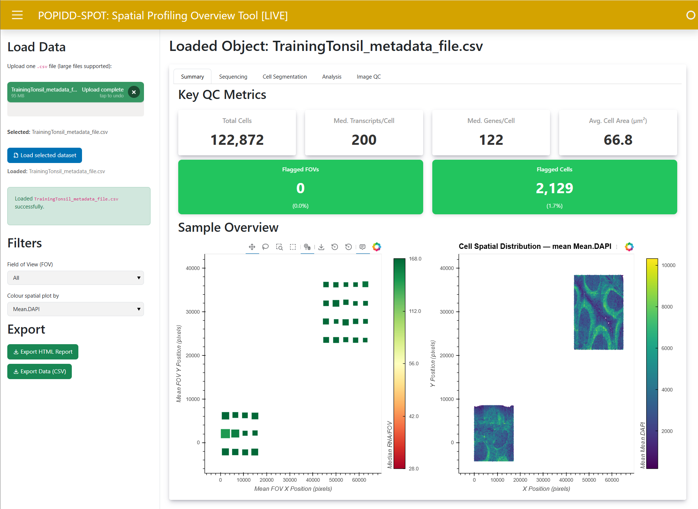
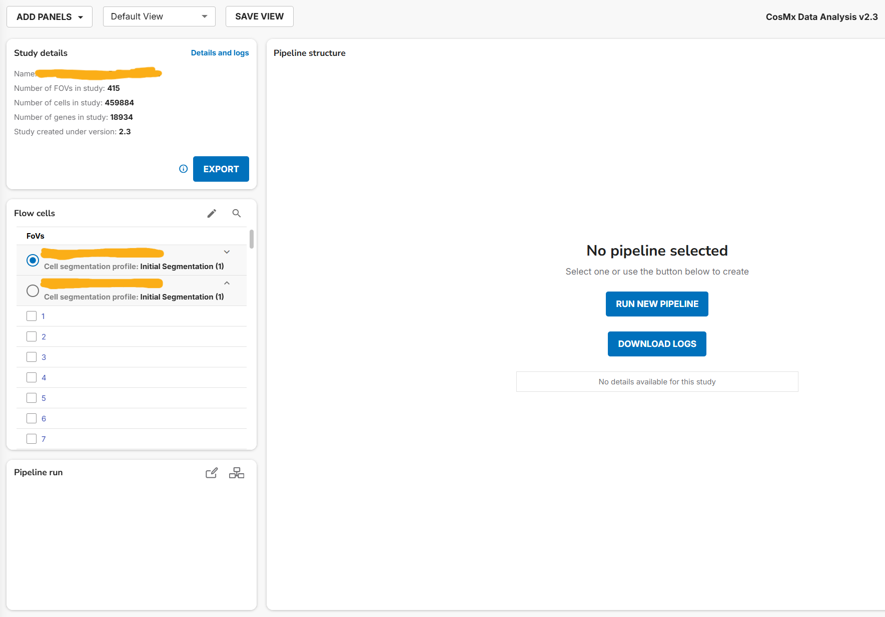
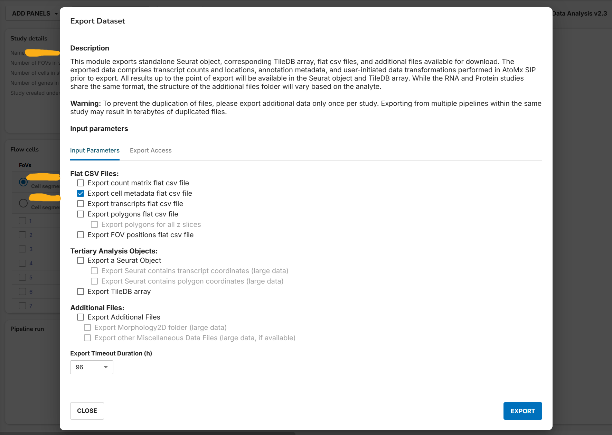
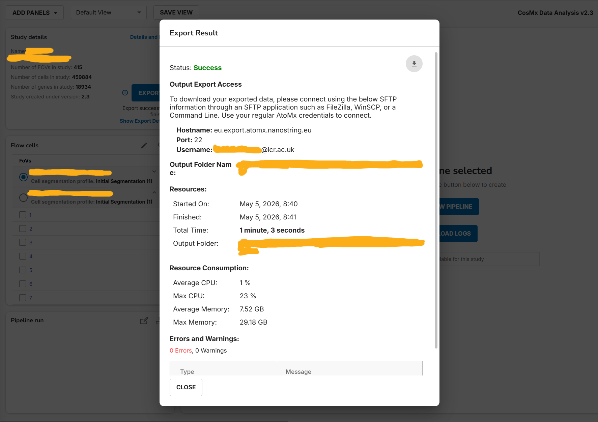

# POPIDD-SPOT: Spatial Profiling Overview Tool

POPIDD-SPOT let's you perform spot checks for spatial transcriptomics datasets and generate shareable reports.

## Requirements

### `uv` installation

- Open terminal
  - Windows Powershell: `powershell -ExecutionPolicy ByPass -c "irm https://astral.sh/uv/install.ps1 | iex"`
  - WLS/macOS/Linux shell: `curl -LsSf https://astral.sh/uv/install.sh | sh`
- Close and open a new terminal

### Data

CSV metadata file in the format of the metadata flat files exported by AtoMx.
Refer to the sample file for an example or the [Downloading Metadata section](#downloading-metadata)  

## Usage

### Running SPOT

- Ensure *input* folder is empty before adding the data to it
- Serve a live app for exploration:
  - Run live with `uv run panel serve spot.py`
  - The side toolbar can be used to, among others, load a file into POPIDD-SPOT.
- Export an HTML report with limited interactibility for sharing:
  - Create reports with `uv run python spot.py`
  - A report for the first file in the input folder (if multiple are present) will
  be saved in the *report* folder.

### Downloading Metadata

- Log in into AtoMx and open the study to be exported 
- Click on the EXPORT button and select the data to be exported
  - To use SPOT, you only need to export the metadata
    - Do so by toggling the *Export cell metadata flat csv file* box under the *FlatCSV Files* section 
  - However, all data including the raw results can also be exported, but this may be done only once.
- After some time, depending on the amount of data being exported, you can click on Show Export Details to see the relevant export information, including username (xxxxx@icr.ac.uk), export server (eu.export.atomx.nanostring.eu), and project name. 
  - **Note that these details may vary!**
- Open a terminal on the folder where metadata will be downloaded
- Run `sftp xxxxx@icr.ac.uk@eu.export.atomx.nanostring.eu`
	- Where xxxxx@icr.ac.uk is the AtoMx user name from the account where the study data was exported
	- You will be asked for your password, type it in the terminal and press enter
- The terminal line will change to sftp, confirm that the data has been saved to the export server by typing `ls`
	- You should see here the name of your study YYYYYY
- Type in `get -r YYYYYY`, where YYYYYY is the name of the study as shown in the previous step
	- This will download all of the exported data to the folder where the terminal was originally opened from
- The .csv files will be compressed into the .gz format.
	- Some applications will support that format, but if you have issues decompressing the file and are on a Unix-like operating system, simply open a new terminal where the .gz file is and then run `gunzip -d ZZZZZ.csv.gz`, where ZZZZZ is the name of the metadata file.